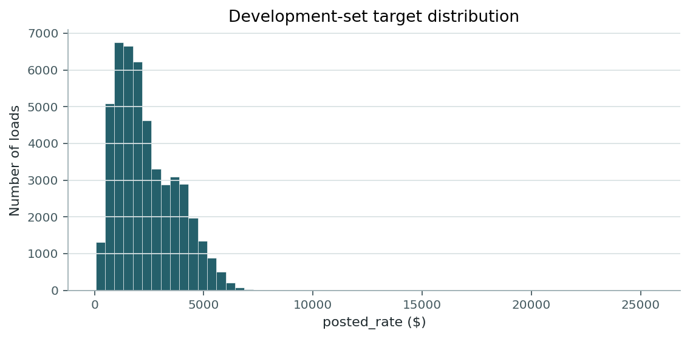
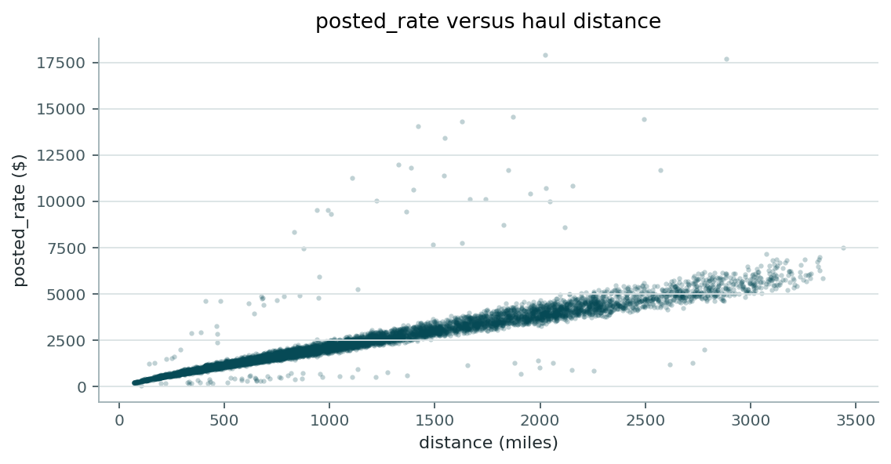
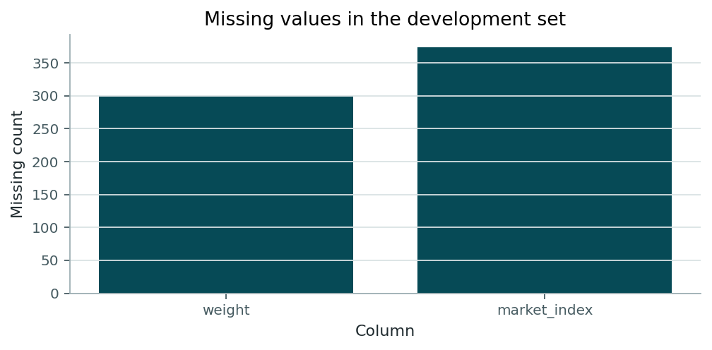
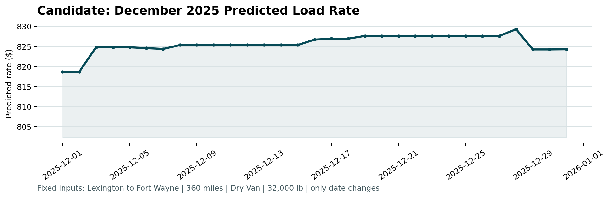

# Freight Rate Prediction

A machine learning pipeline for predicting spot freight rates (`posted_rate`) using historical load, route, equipment, market, and temporal features. Built for a Junior Machine Learning Engineer assessment project.

---

## Overview

Accurate freight rate prediction is essential for spot market pricing, logistics planning, and revenue management. This project implements an end-to-end Python machine learning pipeline that preprocesses raw shipment data, engineers domain-specific geographical and temporal features, evaluates multiple regression baseline models, and generates spot rate predictions for future unseen loads.

---

## Problem Statement

The goal of this project is to predict the `posted_rate` (in USD) for freight loads given shipment attributes including pickup and delivery locations, haul distance, equipment type, cargo weight, pickup date, market index, and quote signal.

- **Target Variable**: `posted_rate` (continuous positive float)
- **Primary Metric**: Mean Absolute Error (MAE)
- **Secondary Metrics**: Root Mean Squared Error (RMSE) and Mean Absolute Percentage Error (MAPE)

---

## Dataset

The assessment provides two main datasets:

1. **Development Set (`train-test.csv`)**:
   - **Rows**: 48,000
   - **Columns**: 14 (includes identifier `load_id` and target `posted_rate`)
   - **Date Range**: January 1, 2025 – October 31, 2025
   - **Usage**: Used for exploratory data analysis, feature engineering fitting, and chronological model validation.

2. **Final Validation Set (`validation.csv`)**:
   - **Rows**: 12,000
   - **Columns**: 13 (target `posted_rate` is omitted)
   - **Date Range**: November 1, 2025 – December 31, 2025
   - **Usage**: Used strictly for generating final model predictions.

> [!NOTE]
> `load_id` (e.g., `TE-000001`) serves solely as a unique row identifier and is excluded from model feature sets. `validation.csv` is never used during model training.

---

## Project Structure

```text
Freight Rate Prediction/
├── data/
│   └── december_chart_inputs.csv
├── outputs/
│   ├── report_figures/
│   │   ├── missing_values.png
│   │   ├── rate_vs_distance.png
│   │   └── target_distribution.png
│   ├── experiment_metrics.csv
│   ├── final_metrics.json
│   └── final_pipeline.joblib
├── scorer_results/
│   └── candidate_december.png
├── src/
│   ├── config.py
│   ├── data_processing.py
│   ├── features.py
│   ├── models.py
│   ├── predict.py
│   ├── train.py
│   ├── validate_outputs.py
│   └── validation.py
├── december-chart-inputs.csv
├── make_figures.py
├── requirements.txt
├── score.py
├── train-test.csv
├── validation-predictions-template.csv
├── validation.csv
├── validation_predictions.csv
└── README.md
```

---

## Exploratory Data Analysis

Exploratory analysis of the 48,000 development loads revealed key structural properties of freight rate pricing:

1. **Strong Linear Relationship with Distance**: Haul distance (`distance`) is the primary driver of posted freight rates, exhibiting a Pearson correlation coefficient of **~0.91** with `posted_rate`.
2. **Right-Skewed Target Distribution**: `posted_rate` values range from \$57.22 to \$25,533.00, with a median of ~\$1,350 and a 99th percentile of \$5,972.83. The distribution features a heavy right tail containing high-rate specialized loads.
3. **Equipment Type Distribution**: The dataset covers three primary equipment types, heavily dominated by Dry Van:
   - **Dry Van**: 27,202 loads (56.7%)
   - **Reefer**: 12,045 loads (25.1%)
   - **Flatbed**: 8,753 loads (18.2%)

### EDA Visualizations

- **Target Distribution**:
  
- **Posted Rate vs. Distance**:
  
- **Missing Values**:
  

---

## Data Quality & Preprocessing

The pipeline addresses several data quality challenges present in the raw input files:

| Data Quality Issue | Finding in Data | Handling Strategy |
|---|---|---|
| **Missing Weights** | 300 missing values in dev set | Imputed using equipment-level median weights fitted on the training split, with fallback to global median weight. A binary `weight_missing` indicator is added. |
| **Negative Weights** | 292 negative values in dev set, 145 in validation set | Corrected by taking the absolute value (`abs()`) and flagged with a binary `weight_was_negative` indicator. |
| **Missing Market Index** | 374 missing values in dev set | Imputed via a Ridge regression model trained on day-of-year Fourier sine and cosine harmonics (`sin_doy`, `cos_doy`). A `market_missing` indicator is added. |
| **Missing Quote Signal** | Missing values in quote signals | Imputed using equipment group medians and a fallback Ridge model fitted on equipment one-hot encodings plus day-of-year Fourier features. A `quote_missing` indicator is added. |
| **Target Outliers** | High-rate loads up to \$25,533 | Retained in training to avoid losing valid market signals. Managed by optimizing L1 absolute error loss and clipping final predictions to `[1.0, 50,000.0]`. |
| **Unseen Cities** | 8 cities in `validation.csv` absent from dev set | Resolved using a city coordinate lookup table (`city_coords_`) constructed from all available pickup/delivery pairs in training data. |

### Data Leakage Prevention

All feature transformations and imputers (e.g., median weight tables, city coordinate lookups, Ridge imputers) are encapsulated inside `FeatureEngineer`, a custom `BaseEstimator` / `TransformerMixin`. Imputer parameters are fitted exclusively on the training fold during validation and on the full 48,000 development dataset prior to final prediction generation.

---

## Feature Engineering

The feature engineering step in `src/features.py` transforms raw load records into 31 model input features (3 categorical, 28 numeric):

- **Categorical Features**: `pickup`, `delivery`, `equipment` (encoded using pandas `CategoricalDtype` with fixed categories learned during fit).
- **Distance & Weight Transformations**:
  - `log_distance`: Logarithm of distance (`log1p(distance)`).
  - `log_weight`: Logarithm of imputed positive weight (`log1p(weight)`).
- **Interaction Terms**:
  - `quote_x_distance`: Product of `quote_signal` and `distance`.
  - `market_x_distance`: Product of `market_index` and `distance`.
- **Geospatial & Route Features**:
  - Coordinate extraction: `pickup_lat`, `pickup_lon`, `delivery_lat`, `delivery_lon`.
  - Latitude and longitude differences: `lat_diff`, `lon_diff`.
  - `haversine_miles`: Great-circle distance calculated via the Haversine formula.
  - `circuity`: Ratio of road distance to Haversine distance (`distance / max(haversine_miles, 1e-6)`).
- **Calendar & Seasonal Harmonics**:
  - Standard date parts: `month`, `day`, `dayofweek`, `weekofyear`, `dayofyear`, `is_weekend`.
  - Cyclical Fourier features: `sin_doy` and `cos_doy` representing annual seasonality:
    $$\sin\left(\frac{2\pi \cdot \text{dayofyear}}{365.25}\right), \quad \cos\left(\frac{2\pi \cdot \text{dayofyear}}{365.25}\right)$$

---

## Validation Strategy

Freight spot rates exhibit temporal trends and market seasonality. Evaluating models using random k-fold cross-validation introduces look-ahead bias and data leakage across time.

To simulate real-world deployment, a **chronological time-based split** (`TIME_VALID_START = "2025-10-01"`) is used:

- **Training Fold**: 43,147 rows (January 1, 2025 – September 30, 2025)
- **Validation Fold**: 4,853 rows (October 1, 2025 – October 31, 2025)

After selecting the top-performing model on the October validation fold, the pipeline refits the chosen model configuration on all 48,000 development rows before generating predictions for the November–December validation set.

---

## Models Evaluated

Nine candidate pipelines and baselines were evaluated on the October validation fold. The exact metrics from `outputs/experiment_metrics.csv` are shown below:

| Model / Baseline | Seed | Train Time (s) | Train MAE (\$) | Train RMSE (\$) | Valid MAE (\$) | Valid RMSE (\$) | Valid MAPE |
|---|---|---|---|---|---|---|---|
| **`hgb_shallow`** | **42** | **2.277** | **83.30** | **582.93** | **127.53** | **648.96** | **0.0573** |
| `hgb_log_target` | 42 | 0.997 | 100.27 | 567.11 | 129.75 | 652.06 | 0.0600 |
| `hgb` | 42 | 4.827 | 80.45 | 582.39 | 131.54 | 649.55 | 0.0591 |
| `hgb_rpm` | 42 | 2.818 | 71.84 | 581.14 | 133.35 | 651.27 | 0.0643 |
| `ridge` | 42 | 0.756 | 133.18 | 588.74 | 163.56 | 652.87 | 0.0983 |
| `linreg_distance` | 42 | 0.417 | 199.45 | 615.60 | 192.77 | 668.21 | 0.1025 |
| `distance_median_rpm` | 42 | 0.412 | 260.78 | 654.39 | 253.85 | 695.05 | 0.1181 |
| `quote_x_distance` | 42 | 0.415 | 211.85 | 659.24 | 413.72 | 798.02 | 0.2099 |
| `median` | 42 | 0.413 | 1127.49 | 1521.01 | 1146.79 | 1567.97 | 0.7252 |

---

## Final Model

The selected model is **`hgb_shallow`**, which achieved the lowest validation MAE (**127.53**).

### Model Configuration

- **Estimator**: `HistGradientBoostingRegressor` wrapped in `ClippedRegressor`
- **Loss Function**: `loss="absolute_error"` (directly aligns with the MAE evaluation metric)
- **Max Depth**: `max_depth=5` (restricting tree depth prevented overfitting relative to the default `max_depth=8`)
- **Learning Rate**: `learning_rate=0.08`
- **Iterations**: `max_iter=250`
- **Leaf Constraints**: `min_samples_leaf=25`
- **Regularization**: `l2_regularization=0.1`
- **Categorical Handling**: `categorical_features="from_dtype"` (native categorical binning)

---

## Results

Key validation performance highlights:

- **Validation MAE**: **\$127.53**
- **Validation RMSE**: **\$648.96**
- **Validation MAPE**: **5.73%**

### Improvement Over Baselines

- **vs. Median Baseline (`median`)**: Reduced validation MAE from \$1,146.79 to \$127.53 (**88.9% error reduction**).
- **vs. Rate-Per-Mile Baseline (`distance_median_rpm`)**: Reduced validation MAE from \$253.85 to \$127.53 (**49.8% error reduction**).
- **vs. Standard Ridge Regression (`ridge`)**: Reduced validation MAE from \$163.56 to \$127.53 (**22.0% error reduction**).

---

## Final Predictions

The generated prediction file is saved to `validation_predictions.csv`.

- **Format**:
  ```text
  load_id,predicted_rate
  TE-000001,848.8319703607287
  TE-000002,4884.750900855534
  ...
  ```
- **Total Rows**: Exactly 12,000 predictions matching `validation.csv`.
- **Validation Status**: Fully verified by `score.py` and format checks.

> [!NOTE]
> Local validation metrics cannot be computed for `validation.csv` because the true target values are omitted from the assessment dataset.

---

## December Analysis

To evaluate how the trained model's predictions respond to temporal variation while holding load characteristics fixed, a benchmark sensitivity analysis was conducted on a reference shipment:

- **Pickup**: Lexington
- **Delivery**: Fort Wayne
- **Distance**: 360 miles
- **Equipment**: Dry Van
- **Weight**: 32,000 lb
- **Timeframe**: Daily from December 1, 2025 to December 31, 2025 (31 days)

### Findings

- Predicted rates remain stable across December, ranging from **\$818.68** (Dec 1–2) to **\$829.27** (Dec 28).
- The slight rate variation reflects seasonal day-of-year trend features learned by the model.
- **Output File**: `data/december_chart_inputs.csv`
- **Generated Visualization**: `scorer_results/candidate_december.png`



---

## Scorer Verification

The assessment verification script `score.py` was run against the generated outputs:

```bash
python score.py --predictions validation_predictions.csv --december-predictions data/december_chart_inputs.csv
```

**Verification Results**:
- Return Code: `0` (Success)
- `12,000` final validation predictions accepted.
- `31` December predictions accepted.
- `scorer_results/candidate_december.png` generated successfully.
- Zero errors or warnings raised.

---

## How to Run

### 1. Install Dependencies

```bash
pip install -r requirements.txt
```

### 2. Generate Exploratory Data Analysis Figures

```bash
python make_figures.py
```

### 3. Run Pipeline (Train, Evaluate, Refit, and Predict)

```bash
python -m src.train
```

### 4. Standalone Prediction Generation (Optional)

```bash
python -m src.predict
```

### 5. Validate Outputs and Run Official Scorer

```bash
python -m src.validate_outputs
```

---

## Output Files

| File Path | Description |
|---|---|
| `outputs/experiment_metrics.csv` | Validation metrics for all 9 evaluated pipelines. |
| `outputs/final_metrics.json` | Final model selection metadata and full training set metrics. |
| `outputs/final_pipeline.joblib` | Serialized scikit-learn pipeline (FeatureEngineer + `hgb_shallow`). |
| `outputs/report_figures/` | Generated EDA PNG charts (`target_distribution.png`, `rate_vs_distance.png`, `missing_values.png`). |
| `validation_predictions.csv` | Final 12,000 predictions formatted for assessment submission. |
| `data/december_chart_inputs.csv` | 31 predicted rates for the fixed December benchmark shipment. |
| `scorer_results/candidate_december.png` | December prediction visualization generated by `score.py`. |

---

## Reproducibility

- **Random Seed**: Fixed to `RANDOM_SEED = 42` across all models and splits.
- **Pipeline Design**: All data cleaning, imputation, and feature transformations are wrapped inside scikit-learn `Pipeline` objects to prevent non-deterministic order of operations.
- Re-running `python -m src.train` produces identical results and prediction outputs.

---

## Technologies Used

- **Language**: Python 3
- **Data Manipulation**: `pandas`, `numpy`
- **Machine Learning**: `scikit-learn` (`HistGradientBoostingRegressor`, `Ridge`, `LinearRegression`, `DummyRegressor`, `ColumnTransformer`, `Pipeline`, `OneHotEncoder`, `StandardScaler`, `SimpleImputer`)
- **Model Persistence**: `joblib`
- **Visualization**: `matplotlib`

---

## Limitations

1. **No Local Error Metric for Final Validation**: Because `validation.csv` does not contain true target rates, final test performance relies on external assessment scoring.
2. **Unseen Location Extrapolation**: The final validation set includes 8 cities not present in the development data; these rely on fallback city coordinate lookups rather than city-pair historical rate histories.
3. **Historical Market Range Assumptions**: Predictions assume that future macroeconomic indicators remain within the overall bounds observed between January and October 2025.

---

## Conclusion

This project delivers a complete, reproducible machine learning solution for freight spot rate prediction. By combining domain-informed feature engineering (circuity, Haversine distance, quote/market interactions, and Fourier temporal harmonics) with a shallow `HistGradientBoostingRegressor` optimized for absolute error loss, the pipeline achieves a validation MAE of **\$127.53**—a **88.9% reduction in error** over the baseline median predictor.